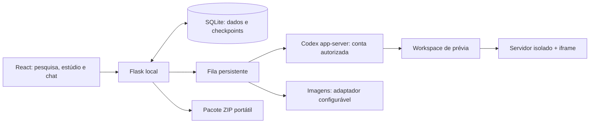

# EDY CRM

**Desenvolvido por EDY GOMES.** Um workspace local para transformar pesquisa e informações revisadas em propostas visuais, pacotes portáteis e prévias de sites que podem ser refinadas por texto ou voz.


Este é um **case público de engenharia**, com código executável e demonstração isolada. Os dados das capturas são fictícios. Nenhuma página representa um cliente contratado, site oficial ou resultado comercial.

## O problema e o fluxo

Organizar fontes, materiais, referências e decisões antes de construir uma landing page evita perder contexto entre pesquisa e implementação. O EDY CRM conserva esse trabalho e as versões produzidas:

**Pesquisar/contextualizar → revisar o brief → preparar propostas visuais → escolher a composição → construir HTML → abrir e refinar por texto/voz.**

Na rota com IA, o executor principal é o Codex app-server com login nativo ChatGPT autorizado. O modelo preferido é **GPT-6.1 Sol · raciocínio Alto · velocidade Padrão**. Catálogo e autenticação não comprovam acesso à inferência; a interface diferencia os estados. API keys e provedores alternativos têm configuração e cobrança próprias.

## O que está implementado

- Empresas, fontes, pendências, filtros e possíveis duplicatas; cadastro e upload manual.
- Leitura de sites com diagnóstico de robots.txt, HTTP/rede e associação do site à empresa.
- Briefs adaptativos versionados; regras por empresa/projeto, referências HTML e biblioteca de instruções.
- Estúdio de propostas raster, seleção antes da construção, montagem por seção, materiais e versões.
- Exportação ZIP com documentos, contexto, manifestos e apenas materiais permitidos/selecionados.
- Fila persistente, checkpoints, cancelamento cooperativo, erros e recuperação de prévias locais.
- Chat de criação/refinamento, captura de áudio e transcrição local opcional para revisar antes de enviar.
- Temas Claro/água, Escuro/fumaça e Nebulosa, pausa e respeito a movimento reduzido.
- Usuários, workspaces, tarefas e funil; modo pessoal local disponível.

Codex teve inferência e refinamento reais validados no ambiente privado de desenvolvimento. A demonstração pública usa **o construtor determinístico local**, sem simular geração de IA. Google, Instagram e demais fornecedores não ganham acesso apenas por clonar o repositório. Veja a [matriz de integrações](docs/INTEGRACOES.md).

## Arquitetura

React 19, TypeScript, Vite, Tailwind, TanStack Query e Framer Motion no frontend; Flask/Waitress, SQLite e Python no backend. Pilhas e ferramentas legadas do ProspectOS continuam no código, mas `ed_app.py` serve as rotas EDY; o desktop Electron legado não foi empacotado nesta entrega.



## Rodar no Windows

Verificado em **Windows, Python 3.12.10 e Node.js 24.17.0**, com PowerShell e Git. Não há validação de instalação em Linux/macOS. Python e Node devem estar no PATH. O projeto contém locks do frontend, desktop legado e dependências Python.

```powershell
git clone https://github.com/EDY075/EDY-CRM.git
cd EDY-CRM
.\configurar-ed-crm.ps1
.\iniciar-ed-crm.ps1 -Demo
```

Abra **http://127.0.0.1:5128**. Se houver outro CRM nessa porta, use `-Porta 5180`. Ctrl+C encerra o servidor; servidores de prévia são encerrados com o processo.

O modo `-Demo` cria somente `data-demo/` neste checkout: três empresas completas e fictícias, com serviços, horários, contatos inválidos/de exemplo, briefs, ilustrações próprias, pacotes e HTMLs distintos. Ele não importa, abre ou copia o banco de trabalho. O seed é idempotente e recusa outras pastas ou um banco já preenchido sem sua marca. Domínios `.example`, telefone `(00) 0000-0000` e perfis fictícios **não são canais de contato**. A geração nativa requer configuração fora do exemplo; veja [como experimentar](docs/DEMONSTRACAO.md).

Para uso local vazio, encerre o exemplo e execute o comando abaixo, sem `-Demo`:

```powershell
.\iniciar-ed-crm.ps1
```

Esse modo cria `data/` próprio e mantém arquivos de prévia em `data/previas/`. Não copie bancos ou sessões de outra instalação. Credenciais são opcionais para iniciar. Se necessárias, copie `.env.example` para `.env` e configure apenas os acessos desejados, ou use **Configurações → Conexões**. O launcher carrega somente o `.env` deste checkout. Nunca envie credenciais ao GitHub.

## Verificar

```powershell
.\.venv\Scripts\python.exe -m pytest -q
cd frontend
npm run lint
npm run build
npm audit
```

Os testes usam bancos temporários dentro de `.cache/`. Build aprovado não é aprovação visual nem teste de operação externa. O [relatório de verificação](docs/VERIFICACAO.md) identifica escopo, avisos herdados e evidências desktop/mobile. Testes de navegador adicionais estão em `frontend/tests/`; consulte suas dependências no relatório antes de executá-los.

## Conhecer o case

- [História de engenharia, decisões e aprendizados](docs/CASE-STUDY.md)
- [Integrações e acessos pendentes](docs/INTEGRACOES.md)
- [Demonstração e capturas](docs/DEMONSTRACAO.md)
- [Pacote completo de uma empresa fictícia](examples/demonstracao/casa-aurora/README.md)
- [Verificações e limites](docs/VERIFICACAO.md)
- [Segurança e publicação](SECURITY.md)
- [Origem, licenças e materiais](NOTICE.md)

O fluxo ainda exige mais etapas que o objetivo inicial de uma landing simples; simplificação é uma oportunidade futura. A qualidade da página depende de brief, seleção de materiais, revisão humana e acesso ao executor. Não existe coleta universal de Instagram/Google, fallback gratuito garantido, preservação perfeita de identidade por IA ou publicação automática de clientes.

## Autoria e origem

**Desenvolvido por EDY GOMES**, a partir de [ProspectOS, de nando0x](https://github.com/nando0x/ProspectOS). A [licença MIT original](LICENSE), com copyright de Fernando, foi preservada. As contribuições EDY incluem contexto adaptativo, estúdio visual, integrações e pipeline de prévias/refinamentos. A publicação tem histórico limpo para excluir dados privados; o histórico original permanece local. Dependências e componentes mantêm suas próprias licenças.

[GitHub](https://github.com/EDY075) · [LinkedIn](https://www.linkedin.com/in/edmilsongomes21/) · [Instagram](https://www.instagram.com/edmilson_zn_/)
