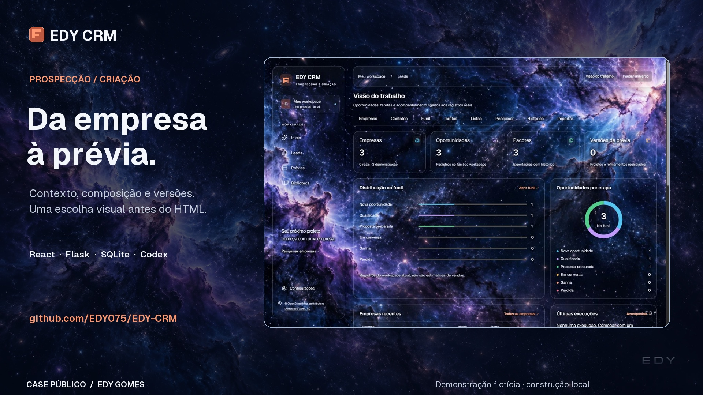

# Apresentação do case

Tour de **1 min 36 s**, com 30 áreas da aplicação realmente servida no Chrome. Captura e edição em 6 de outubro de 2026. Desenvolvido por EDY GOMES.

[Assistir/baixar o MP4 compacto](assets/edy-crm-apresentacao.mp4) · [Vídeo 1080p em maior qualidade](https://github.com/EDY075/EDY-CRM/releases/download/case-media-2026-10-06/edy-crm-tour-1080p.mp4)

## O que o vídeo demonstra

Navegação pela aplicação, organização dos três negócios fictícios, materiais, instruções, seleção visual, montagem, exportação e HTML local aberto dentro do CRM em desktop/celular. O universo animado foi gravado da interface. As capturas não usam tarjas ou nomes censurados: o cadastro é completo e fictício desde sua origem.

O tour é editado, com tomadas de diferentes páginas; não é uma execução contínua de geração. As prévias são HTMLs reais produzidos pelo construtor local, sem IA. Google/Instagram aparecem com acesso pendente. Não houve nova coleta externa, captura física de voz, inferência Codex ou refinamento enviado durante esta gravação. A área de chat mostra um rascunho não enviado. A operação real anterior do Codex e do microfone pertence ao ambiente privado e está delimitada no case e na matriz de integrações.

Foi preparada pelo botão do estúdio uma versão Pillow neutra de ilustração, em situação para revisão, mantendo o original. Ela não foi aprovada para substituir o material selecionado. Listas, contatos, histórico de pesquisa e execuções vazias continuam identificados como vazios.

## Capítulos

| Tempo | Área | Escopo mostrado |
|---|---|---|
| 00:00 | Abertura | Identidade EDY e proposta do case |
| 00:03 | Visão do trabalho. | Indicadores do workspace fictício. |
| 00:06 | Pesquisa por nicho. | Fontes configuráveis; acesso pendente nesta demo. |
| 00:09 | Leads com origem. | Filtros, etapas e possíveis duplicatas. |
| 00:12 | Uma ficha por empresa. | Fatos revisados, fontes e pendências. |
| 00:15 | Cadastro de contatos. | Área disponível; vazia nesta demonstração. |
| 00:18 | Oportunidades por etapa. | Organização do acompanhamento interno. |
| 00:21 | Tarefas e revisão. | Próximas ações ligadas às empresas. |
| 00:24 | Listas de trabalho. | Área disponível; vazia nesta demonstração. |
| 00:27 | Histórico de pesquisa. | Nenhuma consulta externa nesta demonstração. |
| 00:30 | Importar e revisar. | CSV e comparação de duplicatas. |
| 00:33 | Revisar as evidências. | Site oficial exige confirmar a associação. |
| 00:36 | Instagram com evidências. | Coleta depende de acesso; perfil fictício. |
| 00:39 | Materiais selecionados. | Origem e autorização antes de exportar. |
| 00:42 | Original preservado. | Versão Pillow local criada para revisão. |
| 00:45 | Brief adaptativo. | Fatos, copy e design ficam separados. |
| 00:48 | Instruções versionadas. | Contexto e correções por escopo. |
| 00:51 | Skills no projeto. | Instruções materializadas no pacote e runtime. |
| 00:54 | Escolha antes do HTML. | Referências candidatas, sem aprovação automática. |
| 00:57 | Revisar a montagem. | A decisão visual continua com o usuário. |
| 01:00 | Um pacote portátil. | Brief, DESIGN, fontes e materiais selecionados. |
| 01:03 | Projetos para abrir. | Cada empresa mantém sua própria prévia. |
| 01:06 | Prévia dentro do CRM. | HTML real do construtor local, sem IA. |
| 01:09 | Confira no celular. | Alternância de largura na mesma prévia. |
| 01:12 | Versões vinculadas. | Arquivos salvos e histórico por empresa. |
| 01:15 | Texto ou voz. | Compositor revisável; rascunho não enviado. |
| 01:18 | Acompanhar as etapas. | Fila, checkpoints e recuperação; sem jobs nesta demo. |
| 01:21 | Rotinas locais. | Agendamento enquanto o CRM está ligado. |
| 01:24 | Conexões com estados. | Configuração não comprova operação do fornecedor. |
| 01:27 | Aparência independente. | Água, fumaça, universo e controle de movimento. |
| 01:30 | Seu workspace local. | Preferências, usuários e acesso aos serviços. |
| 01:33 | Encerramento | Link do projeto |

## Arquivos e conferência

- MP4 H.264, 1920 × 1080, 30 fps, 2.880 frames, áudio AAC estéreo a 48 kHz, duração de 96 s.
- Versão compacta abaixo de 10 MB no repositório; master em maior qualidade na release, sem aumentar o clone com a gravação original.
- Capa horizontal 1920 × 1080, social 1200 × 630 e vertical 1080 × 1920. A vertical é uma capa, não uma nova filmagem mobile.
- Revisão dos 30 pontos médios, abertura, encerramento e cortes; correção de enquadramentos de leads, comparação de materiais e montagem.
- Fonte Geist com ASCII e acentos portugueses verificados; sem glifos ausentes nas legendas. As letras estranhas da primeira capa eram uma seleção incorreta do subconjunto tipográfico.
- Metadados, hashes e tamanhos em [manifesto](assets/media-manifest.json). Decodificação integral e reprodução no navegador verificadas separadamente da inspeção de frames.

## Música e licença

“Horizons” by Scott Buckley – released under CC-BY 4.0. www.scottbuckley.com.au

Fonte: [Horizons, biblioteca oficial de Scott Buckley](https://www.scottbuckley.com.au/library/horizons/). [Licença CC BY 4.0](https://creativecommons.org/licenses/by/4.0/). Trecho 123–219 s, normalização de volume e fades. A licença MIT do código não relicencia a música. O MP3 original não é redistribuído isoladamente. A utilização não indica endosso do compositor.

## Usar o material

As [capturas desktop/mobile](DEMONSTRACAO.md) complementam o tour. As capas [social](assets/edy-crm-social.jpg) e [vertical](assets/edy-crm-vertical.jpg) estão disponíveis para divulgar este case com os mesmos limites de demonstração. Nenhuma publicação em outra rede ou prospecção foi enviada nesta rodada.

[Roteiro e direção](ROTEIRO-VIDEO.md) · [Case de engenharia](CASE-STUDY.md) · [Integrações](INTEGRACOES.md) · [Verificações](VERIFICACAO.md)
