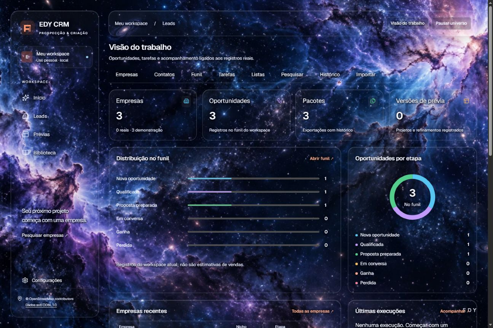
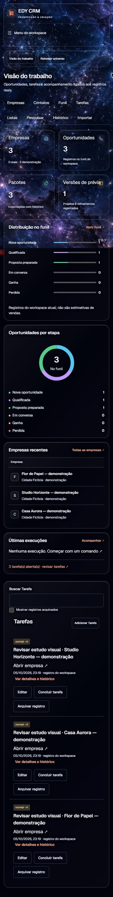
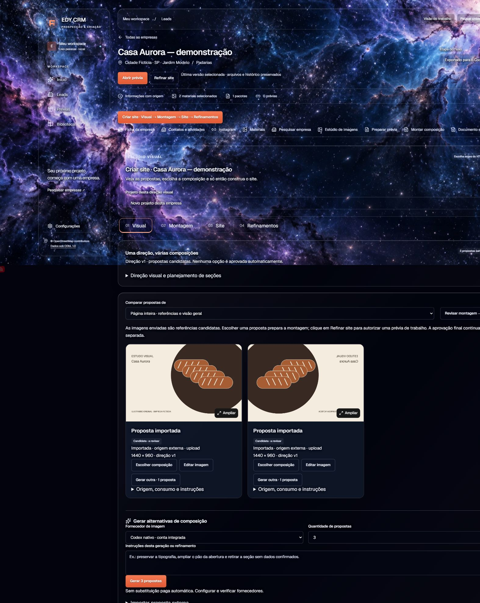
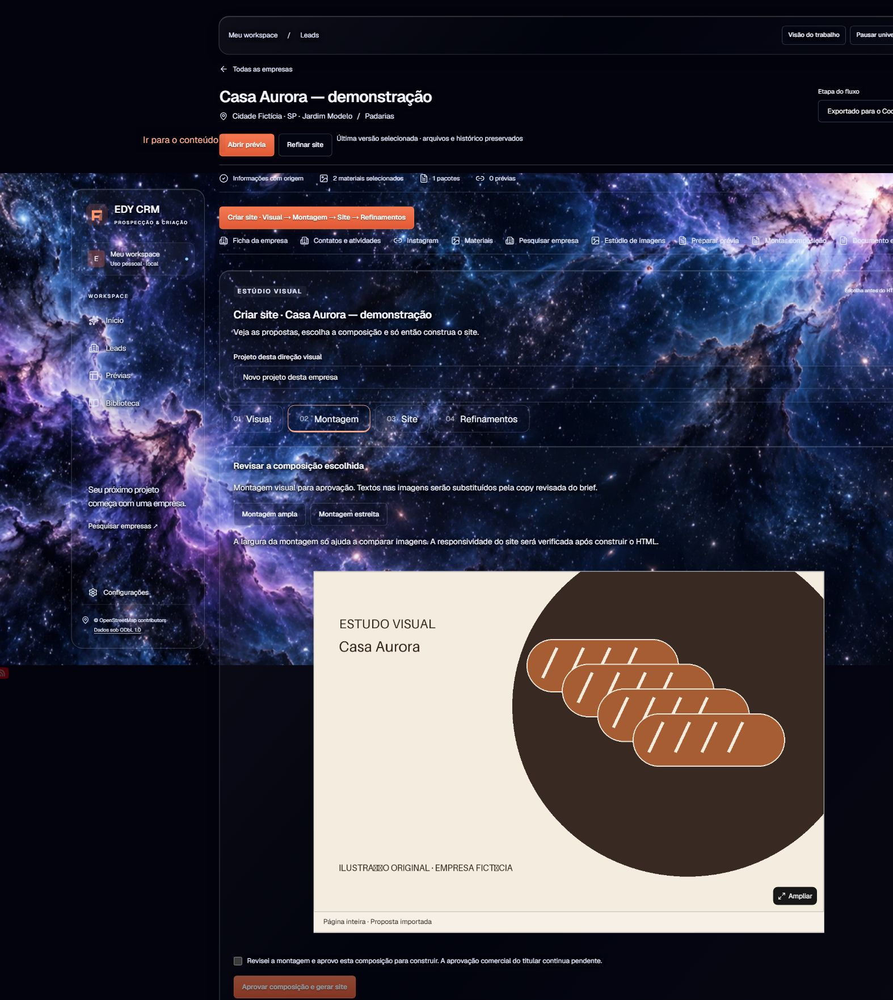
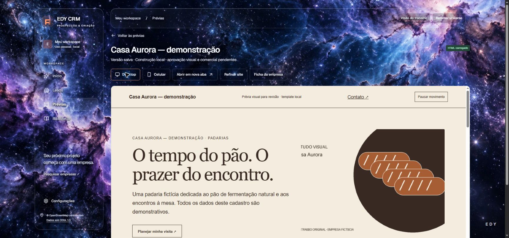
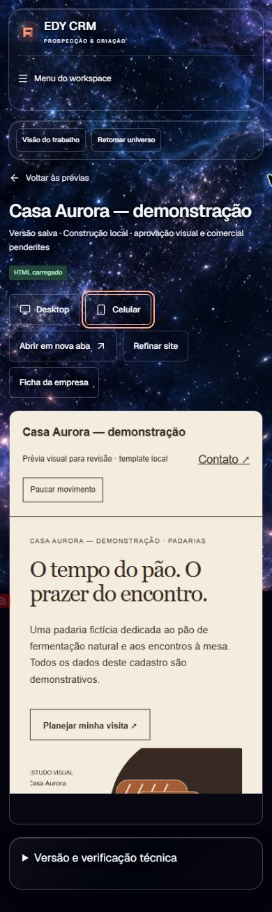
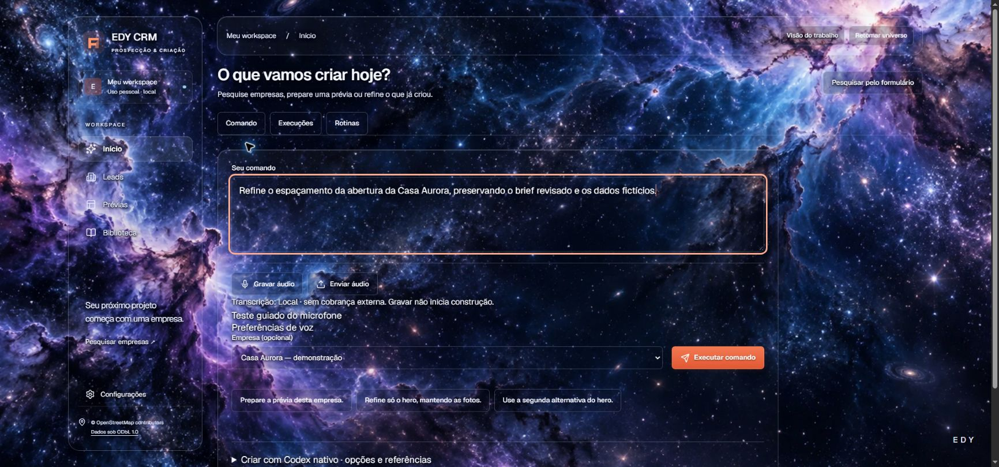

# Demonstração isolada

Execute `./iniciar-ed-crm.ps1 -Demo` após a configuração. O exemplo fica exclusivamente em `data-demo/`. Ele prepara três empresas **100% fictícias**, em nichos distintos, com cadastro, oferta, serviços, horários, endereço, canais de exemplo, brief revisado, ilustrações originais, oportunidades, tarefas, exportações e prévias locais.

| Empresa fictícia | Direção | Dados/materiais |
|---|---|---|
| Casa Aurora | Padaria editorial, papel/terracota | Pães, café, cestas, horários e localização inventados; ilustrações geométricas de pão |
| Studio Horizonte | Pilates, verde frio e espaços | Mobilidade/pequenos grupos fictícios; sem equipe, certificação ou promessa clínica real |
| Flor de Papel | Ateliê floral, vinho e botânica | Buquês/arranjos fictícios; ilustrações abstratas, sem catálogo ou estoque real |

Todos os campos comerciais do exemplo são dados fictícios revisados apenas para a demonstração. `.example` é domínio de exemplo, telefone zero é inválido e perfis sociais são placeholders. **Não acione esses canais.** Não há fotos genéricas apresentadas como produtos, pessoas ou instalações reais.

## Experimentar o fluxo existente

1. Abra **Visão do trabalho** e **Leads**. A indicação de demonstração acompanha cada empresa.
2. Entre em Casa Aurora. Confira cadastro/fontes, preparação e brief. Edite a oferta ou o texto de uma seção se desejar; nova revisão será necessária quando o contexto mudar.
3. Em **Criar prévia**, veja as propostas importadas. São estudos raster desenhados pelo seed, sem inferência de IA. Escolha/refine a composição antes de usar o executor nativo configurado; uma escolha não gera HTML automaticamente.
4. Confira **Montar página**: alternativas locais por seção, texto, recortes e posição. O seed usa o construtor determinístico já existente e produz uma prévia, sem afirmar acabamento equivalente à geração personalizada.
5. Em **Prévias**, clique **Abrir prévia**. O CRM inicia o servidor dos mesmos arquivos. Use desktop/celular e interaja com âncoras, foco e pausa de movimento.
6. No **Início/chat**, associe a empresa, revise a instrução e o modo escolhido. O compositor aceita texto ou microfone, com transcrição revisável. Transcrição exige instalação do modelo local ou provedor autorizado; o exemplo não simula uma gravação nem uma inferência concluída.
7. Exporte um novo ZIP na ficha. O pacote inclui dados, fontes, decisões, manifestos e imagens autorizadas. Seus arquivos têm caminhos relativos.

Refinamento Codex de uma prévia nativa requer runtime/login e acesso real ao modelo. As prévias do seed são **templates locais**, identificados como tal; não foram disfarçadas como versões produzidas pelo Codex para habilitar um botão. A operação nativa/humana anterior está descrita, sem dados de cliente, no [case](CASE-STUDY.md).

Um [pacote real exportado da Casa Aurora fictícia](../examples/demonstracao/casa-aurora/README.md) também está disponível, com ZIP, documentos extraídos, duas ilustrações próprias e manifesto. Não há dados de cliente, credenciais ou caminhos temporários no exemplo.

## Capturas da aplicação servida

Capturas reais de banco fictício; nenhuma tela foi redesenhada ou montada como mockup para este README.

